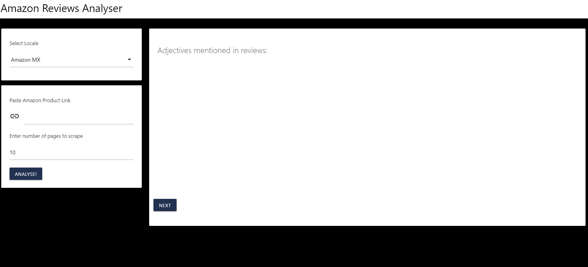

<!-- README.md is generated from README.Rmd. Please edit that file -->

# amzreviewer

<!-- badges: start -->

[](https://www.tidyverse.org/lifecycle/#experimental)
<!-- badges: end -->

The goal of amzreviewer is to provide a simple app to showcase a couple
of functions to scrape and analyse Amazon Product Reviews.

You can read more about it
[here](https://deividmateos.netlify.app/post/r-meets-amazon/).

## Installation

You can install the development version from
[GitHub](https://github.com/) with:

``` r
# install.packages("devtools")
devtools::install_github("alberto-mateos-mo/amzreviewer")
```

To launch the app just run:

``` r
library(amzreviewer)
run_app()
```


